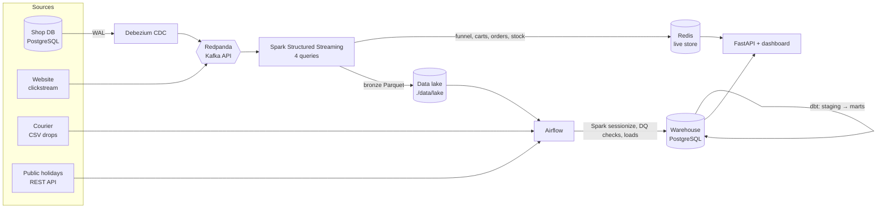

# CartPulse

**Real-time and batch analytics for an online store, built end to end on a laptop.**

CartPulse watches a (simulated) South African online shop. It answers
questions at two speeds:

- **Right now, within seconds:** today's revenue, live shopper sessions, the
  checkout funnel, carts abandoned in the last few minutes, products about to
  run out.
- **Over time, every 30 minutes:** daily sales against public holidays and
  month-end payday, conversion by traffic source, courier delivery SLAs,
  customer RFM segments, price history and data-quality scores.



## What's interesting in here

| Area | What it does | Where |
|---|---|---|
| **Change data capture** | Debezium streams every insert/update in the shop DB into Kafka. The CDC history becomes **SCD Type 2** dimensions, so price and customer history come for free. | `app/cartpulse/bootstrap.py`, `dbt/models/marts/dim_*.sql` |
| **Event-time windows** | The checkout funnel is counted in 1-minute windows with a 2-minute watermark. Late events (2% are deliberately delayed) still update the right minute. | `streaming/app.py` → `funnel_frame` |
| **Stateful streaming** | Abandoned-cart detection with `applyInPandasWithState` and **event-time timeouts**. A pure-Python state machine sits behind it and is unit-tested on its own. | `streaming/app.py` → `track_carts`, `streaming/cart_state.py` |
| **Exactly-once results** | Spark gives at-least-once delivery. Every sink is idempotent: the file sink commit log, absolute-value Redis writes, `SET NX` guards and `ON CONFLICT` merges. The test suite replays batches to prove nothing double-counts. | `streaming/live_store.py`, `batch/warehouse.py` |
| **Batch processing** | Airflow runs a Spark job that turns raw clicks into sessions (dynamic partition overwrite), then loads the lake into the warehouse and runs `dbt build`. | `airflow/dags/`, `batch/sessionize.py` |
| **Data quality** | Courier files go through rules tagged by dimension. Bad rows are quarantined with reasons, never silently dropped, and pass rates are tracked over time. | `batch/courier.py`, `mart_dq_scorecard` |
| **Point-in-time joins** | Each order joins to the customer and product *as they were when it was placed*. | `fct_orders.sql`, `fct_order_items.sql` |
| **Privacy** | Emails and phone numbers are masked in the marts (and a test enforces it). The API connects as a role that can only read `marts`. | `dbt/macros/mask.sql`, `sql/schema/warehouse.sql` |
| **Serving** | FastAPI serves live views from Redis and history from the marts, plus a single-page dashboard. | `app/cartpulse/api/` |

## Run it

You need Docker Desktop (or Docker Engine with Compose v2) with **about 6 GB of
RAM** allocated, and an internet connection for the first build.

```bash
git clone <this repo> cartpulse && cd cartpulse
make up            # or: docker compose up -d --build
make ps            # wait until everything is running (2-4 minutes on first start)
```

| After | What you'll see |
|---|---|
| ~1 min | The simulator seeds 52 products, 400 customers and 60 days of order history, then opens the store (~24 shopper sessions a minute). |
| ~2 min | Spark is streaming. The dashboard shows live revenue, the funnel, recent orders and low stock. |
| ~8 min | The first abandoned carts appear (5 idle minutes, plus the 2-minute watermark). |
| ≤30 min | The first `cartpulse_batch` run fills the history panels. Run `make batch` to start it now. |

| Open | URL |
|---|---|
| **Dashboard** | http://localhost:8000 |
| API docs (Swagger) | http://localhost:8000/docs |
| Airflow (`admin` / `admin`) | http://localhost:8081 |
| Redpanda Console (topics and CDC events) | http://localhost:8080 |
| Spark UI (streaming queries) | http://localhost:4040 |
| Postgres | `localhost:5432` — `shop`/`shop` (OLTP), `loader`/`loader` (warehouse) |

### Things to try

```bash
# Watch CDC end to end: change a price in the shop DB...
make sql-shop
#   UPDATE products SET price = 99.99 WHERE product_id = 3;
# ...see the change event in Kafka...
make peek T=shop.public.products
# ...and after the next batch run, a new version in the price history:
curl -s localhost:8000/api/products/3/price-history

make peek                                  # raw clickstream events
curl -s localhost:8000/api/live/funnel     # last 15 minutes of the funnel
curl -s localhost:8000/api/customers/42    # masked profile, RFM segment, SCD2 history
ls data/lake/bronze data/lake/quarantine   # the lake is plain folders - open the Parquet files
docker compose restart stream              # kill the stream mid-flight: counters don't double
```

## API

| Endpoint | Source | Answers |
|---|---|---|
| `GET /api/live/overview` | Redis | Today's revenue, orders, AOV, abandoned carts, order status board |
| `GET /api/live/funnel?minutes=15` | Redis | Funnel events and active sessions per minute |
| `GET /api/live/abandoned-carts` | Redis | Most recent abandoned carts |
| `GET /api/live/orders` · `/top-products` · `/low-stock` | Redis | Live order feed, best sellers today, items to reorder |
| `GET /api/sales/daily?days=30` | marts | Revenue per day with holiday, weekend and payday flags |
| `GET /api/funnel/daily` · `/funnel/by-source` | marts | Session funnel and conversion by traffic source |
| `GET /api/delivery/sla?detail=true` | marts | Courier on-time rate, overall or by province |
| `GET /api/customers/segments` · `/customers/{id}` | marts | RFM segments; one customer's profile and history |
| `GET /api/products/{id}/price-history` | marts | SCD2 price and cost versions |
| `GET /api/abandoned-carts/daily` | marts | Abandoned value and carts recovered within 24h |
| `GET /api/data-quality` | marts | Pass rate per rule over 7 days |

## Repository layout

```
docker-compose.yml        9 services, one command
sql/                      Postgres init: shop (OLTP, 3NF) and warehouse schemas, roles
app/cartpulse/
  simulator.py            the "store": shoppers, orders, deliveries, price changes
  bootstrap.py            folders, topics, Debezium connector (idempotent)
  streaming/              Spark Structured Streaming app, cart state machine, Redis writers
  batch/                  Spark sessionize, courier DQ ingest, holidays API, lake → warehouse loaders
  api/                    FastAPI + static dashboard
app/tests/                unit tests + a Spark streaming test on event-time data
airflow/dags/             cartpulse_batch (every 30 min), public_holidays (weekly)
dbt/                      staging views, marts, macros, tests
docs/DESIGN.md            decisions, trade-offs, data model, what I'd do next
```

## Tests

```bash
python -m venv .venv && source .venv/bin/activate
pip install -r requirements-dev.txt        # Spark tests need Java 17 on your PATH
make test
```

The suite covers:
- the cart state machine,
- idempotent Redis writes under replay,
- courier data-quality rules,
- REST API parsing and its fallback,
- the simulator,
- the HTTP API,
- an integration test that runs the real streaming queries on event-time data. It checks funnel windows, that only idle carts are flagged as abandoned, and that converted sessions are not.

GitHub Actions runs the tests, `dbt build` against a real Postgres, and validates the compose file.

## Scope and honesty notes

- The store is simulated. The data has realistic shape (payday spikes,
  loyal-customer skew, courier differences, dirty partner files) but none of it
  is real.
- Live orders move through PLACED → PAID → SHIPPED → DELIVERED in minutes rather
  than days, so the stream has something to show. The delivery SLA mart is
  dominated by the 60-day history, which uses realistic delivery days.
- Postgres stands in for a cloud warehouse, and a local folder for S3. See
  `docs/DESIGN.md` for how each piece maps to AWS, GCP and Azure.

Built with Python 3.11, PySpark 3.5, Redpanda 24.2, Debezium 2.7, Airflow 2.10,
dbt 1.10, PostgreSQL 16, Redis 7 and FastAPI.
